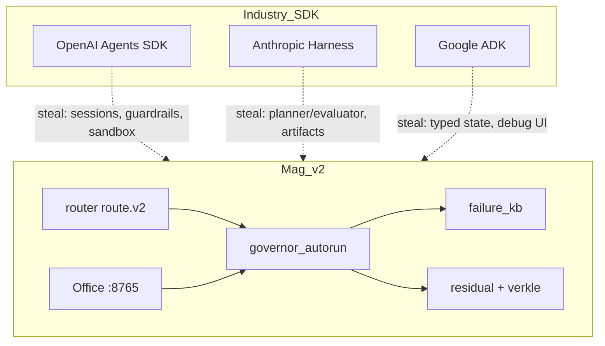

# Agentic capabilities landscape — 2025–2026 deep dive

**Commitment:** `agentic-landscape-2026-001`  
**As-of:** 2026-08-05  
**Parents:** `HANDOFF_MAG_AGENT_TODOS.md` · `COORDINATION_ELIAS_ROPE.md` · `PRODUCT_VISION_AUTORUN.md`  
**Job:** Map recent agentic harness improvements to **stealable contracts** for Mag v2 — not framework cosplay.

---

## 1. Thesis

The industry converged on the same shape Mag already names in DNA:

```text
boundary state (disk) + stateless decoder (seat) + tool loop + trail + human gate
```

What changed in 2025–2026 is **productization**: sandboxes, sessions, guardrails, handoffs, compaction, and evaluator loops are now **SDK primitives** instead of bespoke scripts.

Mag's answer is not "pick OpenAI vs Anthropic vs Google." It is:

> **Steal the contracts. Keep one router. FILE to residual. Never a second DNA store.**

---

## 2. Major frameworks (what shipped)

### OpenAI Agents SDK (2025 → 2026 evolution)

**Primitives:** agents, tools, handoffs, guardrails, sessions, tracing, sandbox execution.

**2026 harness upgrade:**
- Configurable memory / sessions across turns
- Sandbox-aware orchestration (Codex-like filesystem tools)
- Subagents in isolated environments; parallel containers
- Context compaction for long runs

**Mag mapping:**

| OpenAI concept | Mag equivalent | Gap |
|----------------|----------------|-----|
| Sessions | residual + agent_state + trail | Resume test needed |
| Handoffs | `route.v2` seat delegation | Done in #8 |
| Guardrails | G1–G4 + tier refuse + FKB | Test A2 |
| Sandbox | Docker `mag-sovereign` | Done |
| Tracing | governor_autorun_trail, FKB | Done |
| Compaction | context-pack excerpts | Done |
| Subagents | orchestrator spawn | Done |

**Steal:** parallel isolated workers for independent queue items (already orchestrator); **formalize** one sandbox per spawn in container.

---

### Anthropic — long-running harness (planner / generator / evaluator)

**Key paper/engineering themes (2025–2026):**
- Decompose build into tractable chunks
- **Structured artifacts** hand off between sessions (progress files, not chat)
- Three-agent loop: planner → generator → evaluator
- Evaluator uses tools (e.g. Playwright MCP) to verify — load-bearing at capability boundary
- Stronger models (Opus 4.6) reduce harness scaffolding — **evaluator moves to edge cases**

**Mag mapping:**

| Anthropic pattern | Mag implementation |
|-------------------|-------------------|
| Planner | `governor_autorun.plan_pending` + router depth |
| Generator | L2 agent / orchestrator drain |
| Evaluator | pytest + `multi-smoke` + `routing_smoke` — **not LLM-only** |
| Artifacts | residual JSON, knot leaf, `*-verkle.md` |
| Chunking | improve candidates + queue one-goal-per-line |

**Steal (v2.1):** optional **evaluator seat** after heavy_code completes — run targeted pytest fixture from goal metadata; log to FKB on fail.

**Do not steal:** per-sprint evaluator on every scut job — overhead per Anthropic's own 4.6 lesson.

---

### Google ADK (Agent Development Kit)

**Primitives:** typed outputs, session state machine, durable DB backend, `adk run` / `adk api_server`, Cloud Run deploy, ADK Web debugger.

**Mag mapping:**

| ADK concept | Mag equivalent |
|-------------|----------------|
| Typed outputs | JSON schemas in residual, route.v2, REST |
| Session state machine | run_trail seat lock + orchestrator status |
| Durable backend | registry.jsonl + verkle chain |
| Debug UI | lab :8765 + Mag OS v2 strip |
| Event resume | **gap** — handoff JSON + trail, not full ADK |

**Steal:** explicit **run status enum** in orchestrator API (`queued|running|blocked|done|failed`) exposed on autorun card.

---

### LangChain / Microsoft Agent Framework

**Themes:** graph workflows, middleware, telemetry, unified successor to AutoGen + Semantic Kernel.

**Mag mapping:** Mag already has graph edges (`memory/lattice/edges.jsonl`) — **viewport only**. Do not adopt LangGraph as second orchestrator.

**Steal:** middleware hooks on tool dispatch (normalize_args, FKB preflight) — **already shipping in #8/#9**.

---

### OpenClaw / Pi / harness essays

**Themes:** memory promote, dreaming, long-running personal agent, CLI memory.

**Mag mapping:** `improve.yaml` `agent_memory` + `openclaw` sources; map to **promote gate + residual**, not closed harness as DNA.

**Steal:** "dreaming" = Saturday `verkle-audit --full` + improve catchup — offline synthesis, not live token bleed.

---

## 3. Capability matrix — what to implement in Mag v2

| Capability | Industry maturity | Mag priority | Deliverable |
|------------|-------------------|--------------|-------------|
| Unified routing | High | **P0** | PR #8 merge |
| Failure memory (FKB) | Medium | **P0** | PR #9 merge |
| Autorun governor | Medium | **P0** | PR #10 merge |
| Operator pause | Medium | **P0** | PR #10 |
| Container sandbox | High | **P0** | CONTAINER.md |
| Verkle audit + synth | Low (custom) | **P1** | `verkle-audit` CLI |
| Autorun dashboard card | Medium | **P1** | Phase 1 |
| Tier refuse integration test | High | **P1** | Phase 2 A2 |
| Evaluator after heavy jobs | Medium | **P2** | `post_run_eval` hook |
| MCP server for Mag REST | Medium | **P2** | optional `mag/mcp_bridge.py` |
| Resume from trail | High | **P2** | `test_resume_contract` extend |
| Parallel queue workers | Medium | **P3** | orchestrator max_parallel env |
| Claude Code bridge | Medium | **P3** | like cursor_bridge |
| verify-leaf | Low | **P3** | roadmap 2.0 |

---

## 4. Architecture — Mag vs SDK stack



**Collision rule:** SDKs are **reference designs**. Mag router is the only dispatch brain.

---

## 5. Deep implementation notes

### 5.1 Persistence (sessions)

**Industry:** OpenAI Sessions, ADK SQLite state.

**Mag law:** Session = **day bead** (residual + knot). Mid-run = **trail** (warm-mid). Tip advances on SessionEnd only.

**v2 action:** Extend `tests/test_resume_contract.py` — kill orchestrator mid-run, resume from trail + handoff JSON.

### 5.2 Guardrails

**Industry:** parallel input/output validation.

**Mag:** 
- Input: router secret markers, tier classifier
- Output: FKB on tool_fail, collapse escalation
- Parallel: run tier check while planning route (already sync — fast enough)

**v2 action:** `routing_smoke.py` + pytest `test_tier_refuse` in CI.

### 5.3 Evaluator seat

**Industry:** Anthropic evaluator agent with browser MCP.

**Mag:** 
- L0: pytest + multi-smoke (deterministic)
- L2: optional agent re-read of diff (expensive)

**v2 action:** `mag/post_run_eval.py` — if task tag `heavy_code`, run `pytest` path from queue metadata.

### 5.4 Compaction

**Industry:** auto-summarize old turns.

**Mag:** **pack-first** — never ship full chat. Trail cores + bonds carry continuity.

**v2 action:** document in OPERATOR_CARD; enforce in agent_cli max history window.

### 5.5 Handoffs

**Industry:** agent A delegates to agent B via SDK.

**Mag:** `route.v2` returns `seat: cursor` defer — cursor_bridge pack. Not chat between agents.

**v2 action:** Claude Code bridge same pattern as `watch/cursor_bridge.py`.

### 5.6 MCP

**Industry:** Anthropic native MCP for tools.

**Mag:** REST API already exists (`/api/v1/route`, `/api/v1/decide`, `/api/v1/governance`).

**v2.1 action:** thin MCP wrapper exposing pack, route, queue — external seats call Mag as **state server**.

---

## 6. Research sources (improve scout)

Already in `configs/improve.yaml`:

- `agent_memory` tier A URLs (HF memory thread, OpenClaw docs, Anthropic harness essay)
- `agent_harness` tier B (OpenHarness, ADK blog, scaling agents paper)
- Wednesday rotation: arxiv + anthropic + openai

**v2 action:** add improve candidate kind `agentic_contract` when scout finds harness pattern — map via this doc.

---

## 7. Honest gaps (Mag vs frontier)

| Frontier capability | Mag today |
|--------------------|-----------|
| Voice realtime agents | Not in scope |
| Multi-container parallel subagents | Single orchestrator |
| Auto fine-tune from traces | Blocked by design |
| Browser automation evaluator | Not wired (Playwright) |
| Cross-operator discovery | Forest / republic — later |

---

## 8. Weekly agentic + Verkle ritual

```bash
# Saturday (catchup day)
python main.py verkle-audit --full
python main.py improve --once
python main.py improve --status
# Review AGENTIC_LANDSCAPE steal list — pick one P1 item for the week
```

Update this doc when a steal ships — change status in `HANDOFF_MAG_AGENT_TODOS.md` table A1–A12.

---

*End landscape — commitment `agentic-landscape-2026-001`*
