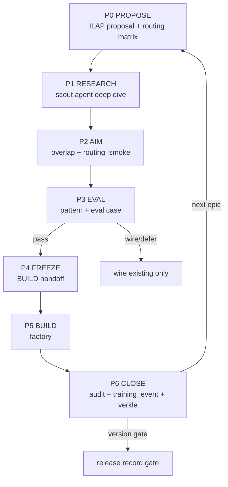

# ILAP — Improvement Loop Aiming Protocol (v1)

**Commitment:** `mag-ilap-protocol-001`  
**As-of:** 2026-08-05  
**Status:** **First iteration** — manual ritual; automate in v4  
**Parents:** `MAG_V4_CONDUCTOR_LOOP_DRAFT.md` · `MAG_STEAL_AUTOPILOT.md` · `FEATURE_COMPOSE.md` · `memory_verkle_map.md` · `MAG_TRAINING_DATA_SPEC.md`

**Job:** Between version arcs and before large BUILD jobs: **research → steal → aim routing → eval → freeze → build**. Cheap scouts (arxiv, Reddit, X, OpenClaw, …) FILE contracts; Verkle subsystems and training events **braid** the core so nothing lives in chat scroll.

**One line:** *Scout foreign signals, map to lattice slots, test our router, then code.*

---

## 0. Where ILAP sits (between versions)

```text
v2 shipped ──► ILAP v1 (research + steal + route test) ──► v3 build waves
                    │
                    ├──► ILAP between v3 waves (each epic)
                    │
v3 substrate ──► ILAP + v4 eval mold ──► v4 steward/conductor
                    │
v4 stable ──► ILAP + v5 scout seats ──► GSTD/Vast/XRPL pipe
```

ILAP is **not a version**. It is the **aiming ritual** that runs:

1. **Between version graduation gates** (before calling v3/v4/v5 “next”)  
2. **Before every factory BUILD** (epic-scale coding)  
3. **Weekly** on improve rotation days (arxiv / Reddit / OpenClaw per `configs/improve.yaml`)

---

## 1. Verkle braid — why logging is intentional

Mag’s subsystems are not silos. ILAP **threads the same join keys** through cold → warm → viewport so the lattice strengthens:

```text
                    verkle_tip (sessions only)
                           │
         ┌─────────────────┼─────────────────┐
         │                 │                 │
    day bead           run + trail       bonds → next session
    (residual)         (warm_mid)        (edges)
         │                 │                 │
         ▼                 ▼                 ▼
   improve scout    training_events     resonance L0e
   field_steal       conductor_trail     context-pack
   research_pack     switchboard_trail   release gates
         │                 │                 │
         └──────── join: run_id · task_id · build_slug · commitment ────────┘
                           │
                    ILAP proposal id
                    steal_card id
                    eval_case id
```

| Subsystem | Lattice role | ILAP phase | Trail / log |
|-----------|--------------|------------|-------------|
| **verkle** | History honesty — tip ≠ story hash | P6 close | `memory/improve/daily/*-verkle-audit.json` |
| **improve** | Scout → candidate → promote | P1 scout | `memory/improve/candidates.jsonl` |
| **field_steal** | Foreign prompt → contract families | P1 deep dive | `memory/improve/field_steal/` |
| **research_pack** | URL / X → structured pack | P1 scout | `memory/research_packs/{slug}/` |
| **resonance** | Soil rhymes with backlog | P2 aim | `memory/resonance/findings.jsonl` |
| **conductor** | Phase + seat prediction | P2 aim | `memory/runs/conductor_trail.jsonl` |
| **routing_smoke** | Contract test (no LLM) | P2 aim | exit code → audit JSON |
| **training_events** | Joinable episodes | all phases | `memory/training/events.jsonl` |
| **factory** | plan → freeze → build → audit | P4–P6 | `memory/runs/build_audit/` |
| **releases** | Version gates | between versions | `memory/improve/releases/gates.jsonl` |
| **FKB** | Fail → remedy | P6 on reject | `logs/failure_kb.jsonl` |

**Law (from `memory_verkle_map.md`):** Field tools (OpenClaw daily notes, HF threads, vendor prompts) map to **bead shape + promote gate** — steal contracts, never foreign DNA. Vectors and chat are **edges or heat**, not cold vertex.

**OpenClaw dreaming map:**

| OpenClaw | Mag ILAP | Writes |
|----------|----------|--------|
| Light scout | improve `--once` + rotation sources | candidates |
| REM synthesize | `improve --synthesize` / field_brief | brief |
| Deep promote | human `promote --apply` only | playbook |

---

## 2. Research agent — P1 deep dive (first iteration)

The **research agent** is not a new throne. It is **improve scout + research-pack + field-steal + FEATURE_COMPOSE**, scoped by ILAP proposal, bounded by `configs/improve.yaml` budgets.

### Sources (configured today)

| Platform | Config key | Tier | ILAP use |
|----------|------------|------|----------|
| arXiv | `arxiv` feeds cs.AI/CL/LG | A | Paper contracts — plan search, memory, agents |
| Reddit | `reddit` LocalLLaMA, AI_Agents, ML | A | Practice trends, harness discourse |
| OpenClaw | `openclaw` docs + Pi | B | Memory promote, dreaming phases |
| **Mesh comm** | `mesh_comm` local clones | A | Bitchat, Bridgefy, Briar — `pull_mesh_comm_repos.sh` |
| GitHub | `github` releases + harness repos | A | Runtime contracts |
| HuggingFace | `huggingface` | A | Model + memory essays |
| X | witness posts | manual | `research-pack --url` — activation, not soil |
| Field archives | `field-steal --root` | local | Vendor prompt → contract families |

**Budget law:** `remote_llm_for_scout: false` — L0 heuristics + scrape; DeepSeek only on **`improve --deep`** opt-in.

### Research agent output (one leaf per dive)

Every dive FILEs **exactly one**:

| Leaf kind | Path pattern |
|-----------|--------------|
| FEATURE_COMPOSE card | `memory/improve/evals/features/{source}-{slug}-{date}.md` |
| Steal ledger row | `memory/improve/field_steal/ledger.jsonl` |
| Research pack | `memory/research_packs/{slug}/REPORT.md` |
| Improve candidate | `memory/improve/candidates.jsonl` |
| Overlap table | §Results in ILAP proposal |

### Steal pipeline (fixed order — never reverse)

```text
foreign signal → identify contract → zeitgeist filter → steal/enhance → compose → measure → promote/reject
```

**Zeitgeist filter rejects:** throne / SaaS memory / chat-as-DNA / auto-merge / T0 export to free remote.

---

## 3. ILAP phases (v1 manual)



| Phase | Seat | Output |
|-------|------|--------|
| **P0 PROPOSE** | You + optional Grok plan | `docs/ref/templates/ILAP-PROPOSAL.md` filled |
| **P1 RESEARCH** | L0 scout + research-pack | steal cards + overlap table |
| **P2 AIM** | $0 harness | routing matrix filled; `routing_smoke.py` green |
| **P3 EVAL** | You | eval case + pattern tag; build/wire/defer decision |
| **P4 FREEZE** | L3 | `queue/handoff/BUILD-{slug}.md` frozen |
| **P5 BUILD** | DeepSeek | branch + implementation |
| **P6 CLOSE** | Cursor audit + you | audit JSON + `training_events` + verkle gap check |

---

## 4. Between-version ritual (first iteration)

Run when moving **v2→v3**, **v3→v4**, or before a **version gate** in `configs/releases.yaml`:

```powershell
# 1. Proposal — what concepts need research before this version?
#    docs/ref/proposals/ILAP-v3-entry.md (example)

# 2. Research week — follow improve.yaml rotation + targeted packs
mag.cmd improve --once                    # daily scout
mag.cmd research-pack --ask "…" --url "…" # deep slice
mag.cmd field-steal --root path/to/archive --max-files 50

# 3. Aim — does our router already cover scout findings?
python main.py resonance --tick --goal "v3-entry"
python scripts/routing_smoke.py
python main.py conductor "representative goals from matrix"

# 4. FILE training episode
python main.py training-events --stats   # expect ilap_cycle / research_dive rows after v1 wire

# 5. Version gate (human)
python main.py release record --version v3 --gate factory_pilot --ok --note "ILAP v3-entry pass"

# 6. Verkle — history honest before claiming graduation
python main.py verkle-audit --dry
```

**Reject upgrading version label if:** overlap redundant + no new eval case + routing matrix fail + no audit leaf.

---

## 5. Training patterns (braid hooks)

ILAP emits patterns defined in `configs/training_patterns.yaml`:

| Pattern | When | Join keys |
|---------|------|-----------|
| `ilap_cycle` | P3 decision recorded | `build_slug`, `commitment`, `run_id` |
| `research_dive` | P1 leaf filed | `source`, `steal_card_id`, `session_id` |
| `steal_compose` | FEATURE_COMPOSE promote candidate | `commitment`, `pattern_tags` |

Example event (append to `memory/training/events.jsonl` manually until CLI helper ships):

```json
{
  "schema": "mag_training_event.v1",
  "pattern": "research_dive",
  "join": {
    "build_slug": "v3-entry",
    "commitment": "mag-ilap-protocol-001",
    "session_id": "ilap-v3-entry-001"
  },
  "input": {
    "sources": ["arxiv", "reddit", "openclaw"],
    "goal": "Map harness memory contracts to verkle bead shape"
  },
  "outcome": {
    "leaf_kind": "feature_compose_card",
    "overlap_action": "wire",
    "pattern_tags": ["steal_compose", "memory_context"]
  }
}
```

---

## 6. How to keep all this in mind (operator load order)

Any seat — human or model — loads **braid context**, not one doc:

```text
1. docs/FRAMEWORK_LOAD.md
2. docs/ref/MAG_ILAP_PROTOCOL.md          ← this file (aiming law)
3. docs/ref/MAG_STEAL_AUTOPILOT.md        ← who to rob + filter
4. docs/templates/FEATURE_COMPOSE.md      ← card shape
5. docs/ref/memory_verkle_map.md          ← field → lattice map
6. configs/improve.yaml                   ← scout sources + rotation
7. configs/training_patterns.yaml         ← pattern vocabulary
8. mag.cmd context-pack --mode janitor
9. ONE ILAP proposal or BUILD from queue/handoff/
```

**context-pack** should eventually include ILAP status line (v4): last research dive · routing matrix pass rate · open version gate.

---

## 7. Anti-patterns

| Don't | Do |
|-------|-----|
| Cloud agent codes before P2 matrix | Route-test on frozen goals |
| Scout chat as memory | One leaf per dive on disk |
| Skip research between versions | ILAP week + release gate |
| Promote foreign prompt verbatim | field_steal contract families only |
| New module when resonance hits ≥3 | wire + improve candidate |
| Claim version without verkle + gates | `release record` + audit JSON |

---

## 8. v1 iteration scope (honest)

| Shipped now | Next wire |
|-------------|-----------|
| improve scout + rotation | `ilap status` CLI |
| research-pack, field-steal | auto training_event on scout leaf |
| routing_smoke, conductor | extend matrix fixtures in pytest |
| training_patterns ilap_* | conductor reads ILAP pass rate |
| This protocol doc | ILAP proposal template in proposals/ |

---

## 9. Links

| Doc | Role |
|-----|------|
| `docs/ref/templates/ILAP-PROPOSAL.md` | P0 template |
| `docs/ref/MAG_BUILD_PIPELINE.md` | P4–P6 factory |
| `docs/ref/MAG_FACTORY_PILOT.md` | Pilot sequence |
| `docs/ref/MAG_V4_CONDUCTOR_LOOP_DRAFT.md` | Eval mold |
| `configs/improve.yaml` | Research agent sources |
| `configs/releases.yaml` | Version gates |

---

*ILAP v1 — first iteration. Amend at version gates; braid joins must stay stable across amendments.*
