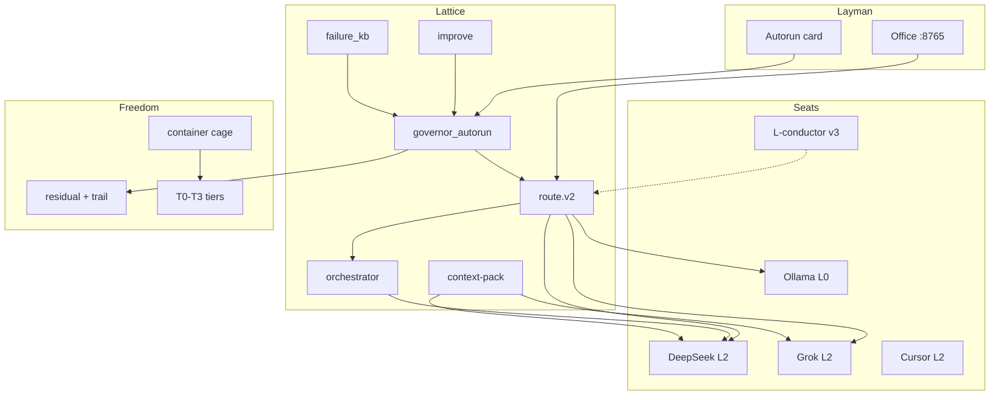

# Mag Resource Harness — Project Proposal

**Version:** 1.0.0-proposal  
**Commitment:** `mag-project-proposal-001`  
**As-of:** 2026-08-05  
**Status:** **Alpha** — constitution + loops exist; product brain is young  
**Direction (v2):** **`docs/ref/MAG_DIRECTION_ARTIFACT_v2.md`** — where we are/going  
**Versions:** **`docs/ref/releases/VERSION_REGISTRY.md`** — v1=Grok origin · v2=this repo · v3=planning  
**Operator:** Nacho · **Repo:** Mag (`local_sovereign_agent`)  
**Sister:** [mycelial-republic](https://github.com/NachoBusiness17/Mag) (forest law, public fork, optional training)

**Activation:** Load this doc + `HANDOFF_MAG_AGENT_TODOS.md` for operations.  
**Children:** `MAG_v2_PLAN.md` · `MAG_v3_RESEARCH_PLAN.md` · `MAG_v3_BACKLOG.md`

---

## 1. Executive summary

**Mag** is a local-first **decision framework** that autoruns AI work on your disk: route jobs to the cheapest safe seat, file outcomes as residual beads, learn from failures, and leave an audit trail — while your footprint stays yours.

We are **not out of alpha**. What exists today is a **constitution** (tiers, gates, DNA), **nested self-improvement loops** (improve, autorun, FKB, verkle), and a **three-layer lattice** (Layman Office · intelligent router · container cage). What does not exist yet is a mature **conductor** — a local expert trained to orchestrate frontier models — or fully automatic **corpus resonance** and **proactive steer**.

**Near term (v2):** merge open PRs (#8–#11), honest autorun on home PC, Office card that speaks human.  
**Medium term (v3 research):** L-conductor, spider, resonance, spore/riddle packs — filed as possibilities, scored against purpose, not promised on a calendar.

**One line:** *Self-improving agent lattice on your disk — layman door, silent router, forkable beads; frontier models are the orchestra, not the conductor.*

Like the founders could not predict every outcome of the Constitution, we do not predict Mag's final product shape. We ratify **law + loops** and let honest cycles compound.

---

## 2. Problem

| Pain | Today's default | Mag answer |
|------|-----------------|------------|
| Chat scroll is memory | Rent context from cloud seats | Residual on disk; pack-first |
| Agent crashes kill the session | One window, one process | Orchestrator spawn; parent survives |
| Token bleed | Same model for scut and architecture | L0 janitor first; L2 scarce |
| No audit | "What did it do overnight?" = scroll | Trail + autorun card + brief |
| Footprint not owned | Data leaves on API calls | T0–T3 tiers; container cage |
| Self-improve = hype | Auto fine-tune theater | improve scout → eval → **human promote** |
| Operator babysits loops | Click promote, say yes, re-steer | v2 autorun; v3 spider + conductor |

**Who it's for:** footprint owners who want an agent as **proxy**, not convenience renters — OpenClaw-shaped autonomy with sovereign disk, not SaaS memory.

**Who it's not for:** people who want a finished chat app, a mirror throne, or AI that runs their life without L3 seals.

---

## 3. Solution

### 3.1 Product (one paragraph)

Mag is not a dataset, not a mirror, not a chat app. It is a **framework that autoruns the agent — including its coding** — so the agent acts as your proxy while gates (constitution, secrets, irreversible acts, operator-active pause) are the only reasons to stop. Work enters via one-line todo; the lattice routes, executes, verifies, records, loops.

### 3.2 Three layers

```text
┌─────────────────────────────────────────────────────────┐
│  LAYMAN — Office :8765 · FIND/FILE/LOAD · autorun card  │
├─────────────────────────────────────────────────────────┤
│  LATTICE — route.v2 → seats → orchestrator → governor   │
│            improve · FKB · trail · context-pack           │
├─────────────────────────────────────────────────────────┤
│  FREEDOM — Docker cage · T0–T3 · residual DNA · fork    │
└─────────────────────────────────────────────────────────┘
```

### 3.3 Gates (law)

| Gate | Rule |
|------|------|
| **G1** | Constitution, tiers, residual — never violate |
| **G2** | Secrets — never read, never echo |
| **G3** | Irreversible — L3 human only |
| **G4** | `MAG_OPERATOR_ACTIVE=1` — autorun pauses while you code |

### 3.4 Seat matrix (market)

| Job | Seat | Provider |
|-----|------|----------|
| Route, ask, brief, improve scout | **L0 janitor** | Ollama `gemma:2b` |
| Short local write | **L0 worker** | Ollama `gemma4` |
| Tool loop, autorun heavy code | **L2 agent** | DeepSeek |
| Architecture, `[priority]` judgment | **L2 TUI** | Grok (scarce) |
| IDE multi-file | **L2 Cursor** | Local + `cursor_bridge` |
| **Orchestration (v3)** | **L-conductor** | Trained local meta-seat |
| Irreversible | **L3** | Human |

---

## 4. Where we are (alpha inventory)

### 4.1 Honest maturity label

| Claim | Reality |
|-------|---------|
| "v2 plan" | Beta-shaped **roadmap**; code partially on branches |
| "Autorun product" | Backend exists; UI card incomplete; operator still steers often |
| "Unified router" | PR #8 not merged to main |
| "Self-improving" | improve loop runs; promote is manual; resonance/spider not built |
| "Trained model" | Research only; Gemma janitors are default |
| "Virtual second desk" | Container + orchestrator + env flags; workstation profile v3 |

**Alpha means:** the constitution is real; the nation is not built.

### 4.2 What works today

- **DNA / residual** — SessionEnd, registry, beads, Verkle tip (sessions)
- **Office** — Dashboard :8765, bonds, briefs, nervous system
- **Seats** — Ollama janitor, DeepSeek agent CLI, Grok TUI protocol, Cursor bridge
- **Orchestrator** — spawn/kill/reap, pigeonhole steer, queue drain
- **Improve** — scout → candidates → eval → gated promote
- **Chord lens** — session-end strike structure (loops, observer charts)
- **Container** — `mag-sovereign` Docker cage documented
- **Research tooling** — verkle-audit, ponytail-audit, virtual-desk-loop (branch #12)

### 4.3 What's in flight (merge before "v2 home")

| Order | PR | Delivers |
|-------|-----|----------|
| 1 | **#8** | Unified `route.v2`, honest seat matrix |
| 2 | **#9** | Failure KB, loop → remedy |
| 3 | **#10** | Governor autorun, operator pause, FKB scoring |
| 4 | **#11** | v2 plan, verkle-audit, agentic landscape |
| opt | **#12** | Virtual-desk DeepSeek research loop (v3-adjacent) |

### 4.4 Known gaps (alpha pain)

- Steer is **reactive** (`!steer`) — no spider watching the web
- Discovery is **manual** — promote buttons, not corpus resonance in pack
- Router entry points were fragmented (fixed on #8, not main)
- Layman autorun card — backend `autorun_status.py`, UI pending
- Years of archive/atric soil — not indexed for auto crosswalk yet
- Cloud agent seat ending — forward stack: **DeepSeek + Grok + Ollama local**

---

## 5. Philosophical frame

### 5.1 Founding documents

| Founding | Mag |
|----------|-----|
| Constitution / Declaration | `CONSTITUTION.md`, DNA, tiers T0–T3 |
| Amendments / case law | `decisions_log.jsonl`, FKB remedies, promote |
| Federalism | Mag (private office) + mycelial-republic (public fork) |
| Unpredictable future | v3 backlog — emergent, not designed in one session |

### 5.2 Core purposes (non-negotiable)

1. **Footprint sovereignty** — operator owns residual; T0/T1 never remote train-on-input  
2. **Honest files** — trail > chat; no greenwash  
3. **Fork equality** — second person runs without your beads or a throne  
4. **Seat economics** — janitor first; frontier scarce  
5. **Human gate on irreversible** — L3 seal; promote for config  
6. **Emergent outcome** — loops compound; we don't predict the final product in alpha  

### 5.3 Strike / spore grammar (optional witness)

Public X posts and riddles = **activation keys**, not ciphertext storage. Private disk = truth. Story root hash ≠ Verkle tip — honesty in `strike_origin.md`.

---

## 6. Nested self-improvement loops

All improvement is **loops inside the lattice**, not separate products:

```text
improve      scout → eval → promote        practices & skills
autorun      fill → route → execute        work queue
FKB          fail → remedy → score         mistakes
verkle       audit → gaps → enqueue        history honesty
resonance    soil ↔ frontier → pack       notice (v3)
spider       watch → steer → trail         live agents (v3)
conductor    route → outcome → train       orchestration (v3)
```

Each loop **files** to residual. None owns the throne.

---

## 7. Where we are going

### 7.1 v2 — exit alpha toward honest lattice

**Goal:** Self-improving lattice on disk with layman door and silent router.

| Phase | Exit |
|-------|------|
| **0** | Merge #8–#10; `.env` documented; container default |
| **1** | `main.py autorun` intelligent; Office autorun card; `GET /api/v1/autorun` |
| **2** | Router-only path; tier refuse tests; FKB on all fail paths |
| **3** | improve daily; verkle weekly; ponytail pre-merge |
| **3.8** | Ponytail/caveman discipline |
| **3.9** | Virtual desk research (ops + REPORT) |
| **4** | Spore spine (optional witness index) |
| **5** | Fork README; forest link; no throne |

**v2 success:** Write one line in todo → AFK → morning card tells truth → merge green on home PC.

### 7.2 v3 — research (not v2 blockers)

**Goal:** Local **conductor** orchestrates frontier models; corpus **notices**; agents **watched**.

| Thread | One line | Backlog |
|--------|----------|---------|
| **L-conductor** | Trained expert at direction/delegation, not mirror | v3-009 |
| **Resonance** | Auto "find shit like this" in any seat lens | v3-008 |
| **Spider** | Proactive steer on orchestrator web | v3-007 |
| **Riddle packs** | Router + encrypted spore job; public riddle, real soil on disk | v3-010 |
| **Virtual desk** | Second workstation; Mag plugs away | v3-006 |
| **Bead export** | Training labels for conductor, not diary mimicry | v3-005 |
| **Life-ops spore** | Agency shape; L3 seal | v3-003 |

Full ledger: `docs/ref/MAG_v3_BACKLOG.md`  
Research plan: `docs/ref/MAG_v3_RESEARCH_PLAN.md`

### 7.3 Training stance

| Train | Don't train |
|-------|-------------|
| Orchestration / route outcomes | Mirror voice from biography |
| Steer policy from case law | From-scratch as L0 replacement |
| Resonance ranker (optional) | Auto fine-tune from traces in lattice |
| In **republic** repo, after eval | Daily GPU burn in autorun |

**train-llm-from-scratch** = republic path for weight craft — parallel to Mag, not daily driver.

---

## 8. Architecture (steady state target)



---

## 9. Operator modes

| Mode | Env | Behavior |
|------|-----|----------|
| **Coding** | `MAG_OPERATOR_ACTIVE=1` | Autorun paused; Cursor owns edits |
| **AFK** | `MAG_DRAINER=1` | Fill queue, drain, verkle gaps |
| **Manual** | `MAG_DRAINER=0` | You drive run/ask/brief |
| **Audit** | Saturday | `verkle-audit --full` |

**Two-desk ritual (v3 ops):** Win Virtual Desktop + Mag Office on desk 2; Cursor on desk 1.

---

## 10. Success metrics

### 10.1 Alpha → v2

- [ ] PRs #8–#11 merged; `routing_smoke` 9/9 on home PC  
- [ ] `autorun --once --dry` plans honestly; overnight run leaves trail  
- [ ] Office card readable without chat scroll  
- [ ] Zero host-roam drainer; container default  
- [ ] FKB records failures; remedies appear in next pack  

### 10.2 v3 research (when gate passes)

- [ ] `decisions_log` has labeled steer outcomes (conductor training signal)  
- [ ] Resonance dry-run surfaces 3 echoes from real residuals  
- [ ] Spider rule table covers heartbeat + FKB repeat  
- [ ] Riddle pack spec + misuse guardrails written  
- [ ] Conductor eval beats heuristic router on 10 frozen prompts  

### 10.3 Economy (always)

- Local tokens ≪ counterfactual Grok dump (`memory/improve/GOAL.md`)  
- Grok = scarce judgment; DeepSeek = heavy code; Ollama = scut  

---

## 11. Risks and non-goals

### 11.1 Risks

| Risk | Mitigation |
|------|------------|
| Pretend we're out of alpha | Label honestly; this doc |
| Second orchestrator / DNA store | One router, residual only |
| Weight train in lattice | Blocked; republic + promote |
| Steer theater without trail | Spider + FKB + verkle |
| Riddle packs → misuse | Tier law; decode on disk; no illegal evasion |
| Token bleed returns | Seat matrix + conductor economics |
| Cloud agent dependency | Local IDE + DeepSeek + pack protocol |

### 11.2 Non-goals (all phases)

- AI runs your life without L3  
- Public residual export by default  
- Core-mirror throne / rank tokens  
- Hermes as default router  
- Predicting final product in proposal doc  

---

## 12. Immediate next actions

### Operator (home PC)

```powershell
# After PR merge
mag.cmd doctor
.\.venv\Scripts\python.exe scripts\routing_smoke.py
python main.py verkle-audit --dry
python main.py autorun --once --dry
mag.cmd context-pack
```

Register: **MagImproveDaily** 08:00 · **MagVerkleWeekly** Sat 09:00 · **MagAutorun** when AFK.

### Agents

1. Merge #8 → #9 → #10 → #11  
2. Ship autorun card UI  
3. Append new ideas to `MAG_v3_BACKLOG.md` only — do not block v2  
4. Feed virtual-desk REPORT when DeepSeek research completes  

---

## 13. Document map

| Doc | Role |
|-----|------|
| **`docs/FRAMEWORK_LOAD.md`** | **LLM/human navigation — load order, metaphors, use cases (start here)** |
| **`MAG_DIRECTION_ARTIFACT_v2.md`** | **Direction v2 — load first for navigation** |
| **`MAG_PROJECT_PROPOSAL.md`** (this) | Full where-we-are / problem / inventory |
| `HANDOFF_MAG_AGENT_TODOS.md` | Operational queue, merge order |
| `MAG_v2_PLAN.md` | v2 phases + acceptance |
| `MAG_v3_RESEARCH_PLAN.md` | v3 research + L-conductor frame |
| `MAG_v3_BACKLOG.md` | Feature ledger (v3-001…) |
| `LAYMAN_OFFICE_VISION.md` | Layman dashboard + Tesuji Grove (v3) |
| `PRODUCT_VISION_AUTORUN.md` | Product one-liner + gates |
| `DNA.md` | Residual constitution |
| `CONTAINER.md` | Freedom cage install |
| `memory/improve/SEATS.md` | Seat matrix |
| `AGENTIC_LANDSCAPE_2026.md` | Industry steals |
| `RESEARCH_MAG_VIRTUAL_DESK.txt` | Workstation research brief |

---

## 14. Closing

Mag is alpha software with a founder's constitution: **law on disk, loops that file work, frontier models as specialists, and an emergent path toward a local conductor that orchestrates without owning your story.**

v2 makes the lattice honest. v3 researches what notices, steers, and conducts. The backlog grows; the end state stays unknown — by design.

---

*End proposal — update at phase gates and major operator sessions.*
