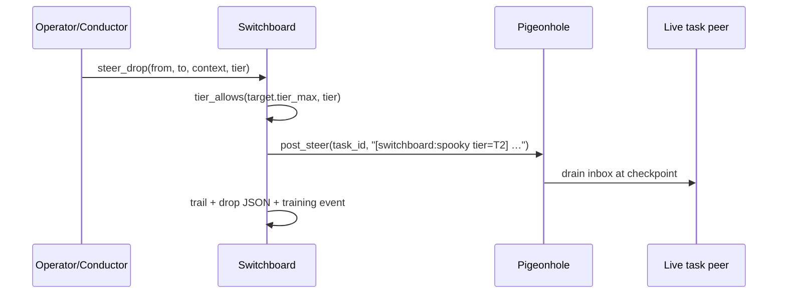

# Mag Switchboard — telepathic operator mesh (v3-014)

**Status:** Research → pilot  
**Module:** `mag/switchboard.py`  
**CLI:** `python main.py switchboard status|mesh|peers|reap|drop|route`  
**Trail:** `memory/runs/switchboard_trail.jsonl`

---

## Problem

Mag already has orchestrator children, pigeonhole mailboxes, router seats, provider
configs, and the Jones fleet — but they were **siloed**. Orphan PIDs, orphan
mailboxes, and seats that don't know who else is live → wasted routing fidelity.

You asked for **no orphan processes**, **OO grouping**, and a **switching operator**
that knows *who it's talking to*, *why*, *what platform/API flags apply*, and
*how important the hop is* — then steers almost telepathically, including lawful
**spooky drops** (tier-bounded context another seat wouldn't normally see).

---

## Metaphor

| Piece | Role |
|-------|------|
| **Nervous system** (`main.py nervous`) | Body glance — keys, ports, containment |
| **Router** (`route.v2`) | Receptionist — classifies goal → seat |
| **Conductor** | Shift lead — phase overlay on route |
| **Orchestrator** | Supervisor — spawns/kills children |
| **Pigeonhole** | Intercom — `!steer` into running agent |
| **Switchboard** | **PBX operator** — full mesh, peer importance, tier drops |

The switchboard does **not** replace nervous or router. It **unifies the live mesh**
so conductor/spider/operator act on one truth.

---

## Object model

### `SeatProfile` (static, config-backed)

Built from `configs/providers.yaml` + `configs/agent_fleet/jones.yaml` + router seats.

- `platform`, `tier_max`, `api_key_env` / `api_ready`
- `importance` score for routing priority
- `fleet_roles` (plan/build/audit/…)
- `group`: `provider` | `router`

### `ProcessPeer` (dynamic, live)

Built from orchestrator `list_tasks_live()` + harness signals (`MAG_DRAINER`,
`MAG_OPERATOR_ACTIVE`, grok budget).

- `peer_id` e.g. `task:tabc123`
- `seat`, `platform`, `status`, `alive`, `phase`, `heartbeat_age_s`
- `importance` boosted for healthy running tasks
- `group`: `live_tasks` | `harness`

Every peer is **addressable** for `steer_drop` when tier law allows.

---

## Tier law (spooky but lawful)

Payloads carry a tier (`T0`–`T3`). A target peer with `tier_max=T1` **cannot**
receive a `T2` drop. Spooky flag marks operator-curated cross-seat share for
training labels — **not** a bypass of tier law.

```text
tier_allows(holder_tier_max, payload_tier)
  ↔ rank(payload) ≤ rank(holder.tier_max)
```

T0/T1 never export to republic training. Drops default to `T2`.

---

## Commands

```bash
.venv/bin/python main.py switchboard status
.venv/bin/python main.py switchboard mesh --json
.venv/bin/python main.py switchboard peers --live
.venv/bin/python main.py switchboard reap
.venv/bin/python main.py switchboard route "implement pytest for switchboard"
.venv/bin/python main.py switchboard drop tabc123 "use BUILD spec section 3" \
  --from conductor --tier T2 --spooky
```

Windows: `mag.cmd` equivalent after venv path.

**Boot stack** (existing): `switchboard_live.cmd` starts dashboard + mag + guard.
**Status** (existing): `switchboard_status.cmd` → `main.py nervous` + trails.
New mesh commands complement those scripts.

---

## Wiring

| Consumer | Use |
|----------|-----|
| **Conductor** | `route_intent()` enriches conduct() with live peer + API flags |
| **Spider** | `reap()` on tick when not dry; orphan signals |
| **Training** | `steer_outcome` events on every drop |
| **Loops registry** | `switchboard` loop entry |

---

## Steering drop flow



---

## Non-goals (alpha honesty)

- Not a second orchestrator — never spawns children
- Not full multi-agent chat — drops are **steer lines**, not sessions
- Not remote mesh yet — home PC brain stem first; Tailscale peers later
- Not auto-spooky — operator/conductor must call `drop`; spider only reaps/steers stalls

---

## Load order

After `docs/ref/MAG_v3_SWARM_VISION.md` when routing/steering work:

1. This file
2. `python main.py switchboard status`
3. `python main.py conductor "goal"` (overlay now mesh-aware via route)

---

## Related

- `docs/ref/NERVOUS_SYSTEM.md` — body glance
- `docs/ref/COORDINATION_ELIAS_ROPE.md` — lattice + nervous
- `docs/ref/JONES_AGENT_FLEET_PACK.md` — fleet roles on seats
- `mag/pigeonhole.py` — knot channel
- `switchboard_live.cmd` / `switchboard_status.cmd` — Windows boot
