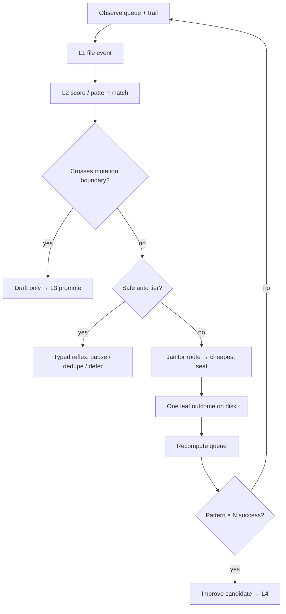

# Mag v4 — Conductor loop discipline (planning draft)

**Status:** Planning only — no auto-promote, no silent config mutation  
**As-of:** 2026-08-05  
**Commitment:** `mag-v4-conductor-loop-001`  
**Parents:** `MAG_LOOP_DISCIPLINE.md` · `MAG_BEHAVIORAL_COMPOUNDING.md` · `MAG_TRAINING_DATA_SPEC.md`

**Read when:** feeding Grok / DeepSeek / Cursor a frozen BUILD spec for loop auto-handling.

---

## North star

> Automatic handling = **typed reflexes with trails**.  
> Learning = **scored episodes** and **human promote**.  
> Never silent router mutation.

**Mag conductor** = `mag/conductor.py` + autorun fill/route/execute on *this* repo.  
Not Microsoft Conductor, LangGraph, or third-party “agent trace” products — those are ops grammar only.

---

## Problem (evidence filed)

| Signal | What it meant |
|--------|----------------|
| Autorun replanned `[test] seat task queue` 2000+× | Plan theater — harness ticks, not agent work |
| Verkle gaps → N× `summarize-session` | Fan-out — cold path treated as hot queue drip |
| “100+ Mag steps” | Usually replan + no `drain_starts`, not one smart session |

Root causes include: stale smoke queue rows, `MAG_OPERATOR_ACTIVE` / drainer pause, per-orphan verkle goals before normalization, fat plan objects logged every 5s.

---

## v4 rules

1. **Gate on measurable progress** — No new fan-out unless a hard counter moves: queue drain, knot filed, test/audit pass, or factory artifact on disk.
2. **Batch cold path** — Orphan residuals → one `backfill-sessions --all`, not N scut spawns.
3. **Freeze config by default** — Router, skills, rails changes = disk artifact + L3 `promote --apply`.
4. **One outcome per leaf** — Exactly one of: knot · test green · PR/spec file · terminal queue state.
5. **Janitor-first** — Dedupe, pause, batch, reap before frontier reasoning.

---

## Promotion ladder (unchanged law)

```text
L1 file     → trails, events, loop-audit rows, FKB sig
L2 score    → severity, confidence, pattern match
L3 promote  → human signs config / RUN / rails change
L4 habit    → promoted skill, spider rule, template clause
L5 constitution → stable law; ordinary runs cannot edit
```

Nothing jumps L1→L4 without L2. No poem without a trail.

---

## Action tiers

| Action | Auto | Draft + notify | Human |
|--------|:----:|:--------------:|:-----:|
| Refuse duplicate enqueue | ✓ | | |
| Slim plan trail / fingerprint skip | ✓ | | |
| Pause autorun fill (N ticks) | ✓ | | |
| Spider signal → Office / nervous | ✓ | | |
| Coalesce verkle → batch goal | | ✓ improve candidate | |
| FKB remedy card | | ✓ | |
| Router / skills / rails edit | | ✓ diff | `promote --apply` |
| RUN sheet / constitution amend | | ✓ diff | Saturday sign |

---

## Loop detectors

Watch **counts and shape**: task count rises but drain, knots, or tests stay flat → waste.

| Detector | Counters | Mag source |
|----------|----------|------------|
| **Plan theater** | `replan_count` ↑, `drain_delta` = 0, `plan_fp` unchanged | `loop-audit`, autorun trail |
| **Verkle fan-out** | `verkle_summarize_count` > 1 for same `session_id` | verkle gaps, queue |
| **Agent churn** | `retry_count` ↑, collapse events, no terminal task | FKB, behavioral_events |
| **Silent mutation** | `config_hash` changed, no promote event | future: config snapshot |
| **Pause blindspot** | `pause_reason` set, replan continues | `autorun_common` |

---

## v4 flow



1. Observe queue and trail → L1 event with join keys.  
2. Score (thresholds + `configs/training_patterns.yaml`).  
3. Mutation boundary → stop; emit draft only.  
4. Else janitor first, then cheapest capable seat.  
5. Require one disk outcome per leaf.  
6. Recompute queue; emit `loop_outcome` if waste detected.  
7. Repeated success → improve candidate, never silent L4.

---

## Events — extend, do not fork

Use existing `mag_training_event.v1` (`docs/ref/MAG_TRAINING_DATA_SPEC.md`).

**New pattern:** `loop_outcome` (or enrich `autorun_cycle` / `spider_signal`).

**Required join keys:** `queue_id` · `task_id` · `session_id` · `plan_fingerprint`

**Example input block:**

```yaml
input:
  queue_depth: 0
  drain_delta: 0
  replan_count: 0
  verkle_summarize_count: 0
  pause_reason: null
  config_hash: ""
outcome:
  waste_kind: plan_theater | verkle_fanout | agent_churn | ok
  action_taken: pause_fill | batch_backfill | dedupe_refused | escalate | observe
  label_source: heuristic
```

---

## Eval cases (frozen — replay before any v4 build)

1. Autorun replans `[test] seat task queue` 2000+×, `drain_starts` = 0 → `plan_theater`, action `pause_fill`.
2. Five verkle orphans → five summarize goals → coalesce to one `backfill-sessions --all` draft.
3. Router preference changes with no `promote_gate` event → `silent_mutation` draft, block.
4. Agent run 100+ tool rounds, zero knot and zero queue terminal → `agent_churn`, escalate.
5. Janitor-eligible scut queued while `MAG_OPERATOR_ACTIVE` → no fill; `pause_reason` logged.
6. Duplicate enqueue same normalized goal → refused, `dedupe_refused`.
7. FKB signature ×8 on goal → `fkb_block_for_goal`, no spawn unless `[mag]`.
8. Factory build without frozen BUILD spec → conductor refuses build phase.
9. Plan depth goal enqueued → `route_task` refuses; file for Grok instead.
10. Successful batch backfill → one knot chain delta, `waste_kind: ok`, no new scut rows.

---

## External grammar (steal boundaries)

| Public pattern | Steal into Mag slot | Refuse |
|----------------|---------------------|--------|
| Deterministic phase machine | factory + conductor phase | Replacing pigeonhole knot |
| Worktree / subprocess isolation | orchestrator child | Second DNA store |
| Skills registry | `configs/skills.yaml` + promote | Auto skill rewrite |
| Observability bursts | loop-audit + spider | Chat as telemetry |
| Eval harness | pytest + factory audit JSON | Mirror / voice labels |

---

## Handoff packet (other AI engines)

```text
1. This file
2. MAG_LOOP_DISCIPLINE.md
3. MAG_TRAINING_DATA_SPEC.md §5–7
4. configs/training_patterns.yaml (draft below)
5. python main.py loop-audit --json  (one snapshot)
6. Two knot.json examples (sparse actual + target rich shape)
7. Single ask + deliverable shape + Constraints block
```

**Constraints block (paste every time):**

- Auto-handle = typed reflexes, not “smarter prompts”
- Config change = improve candidate → human promote
- Join keys on every loop event
- Reject labels: voice, persona, chat tone
- Accept labels: delegation_success, phase_correct, seat_efficient, steer_effective

---

## Next build order (when leaving planning)

| Order | Deliverable | Seat |
|-------|-------------|------|
| 1 | `training_patterns.yaml` + eval JSON | DeepSeek schema |
| 2 | `loop_outcome` emit from loop-audit + spider | Cursor RUN row |
| 3 | Conductor `pause_fill` on plan_theater error | Cursor RUN row |
| 4 | Config hash snapshot (silent mutation) | v4.1 |
| 5 | Office card: loop health one-liner | dashboard |

---

## One-line Office target (v4)

> *Mag OK · loop: plan theater cleared · last leaf: knot filed · next: batch verkle if gaps > 3*

---

*Planning draft — merge to law only via promote gate. Link from HANDOFF when RUN D4 ships.*
