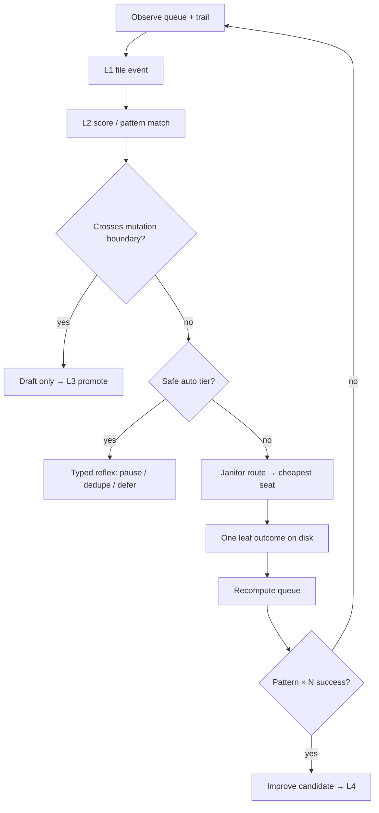

# Mag v4 — Conductor loop discipline (planning draft)

**Status:** Planning only — no auto-promote, no silent config mutation  
**As-of:** 2026-08-05  
**Commitment:** `mag-v4-conductor-loop-001`  
**Parents:** `MAG_LOOP_DISCIPLINE.md` · `MAG_BEHAVIORAL_COMPOUNDING.md` · `MAG_TRAINING_DATA_SPEC.md`  
**Related:** `MAG_LOCAL_STEWARD.md` (janitor jobs, Verkle read, actor memory)

**Read when:** feeding Grok / DeepSeek / Cursor a frozen BUILD spec for loop auto-handling.

---

## v4-first doctrine (direction before volume)

**v4 is built before v3 finishes** — not as a sequel, but as the **mold** v3 work must fit.

| v4-first (process before incident) | v3-last (bloat trap) |
|-----------------------------------|----------------------|
| Eval cases + patterns **before** new loops | Ship loop, mine waste later |
| RUN row defines outcome gate **before** code | Feature merges, audit someday |
| `training_patterns.yaml` slot for every new behavior | Ad-hoc spider rule in prompt |
| Conductor tier: auto / draft / human **before** autonomy | “Smarter model will fix it” |
| One leaf outcome required to call work done | Green checks, chat summaries |

**Growth rule:** New capability is allowed only if it answers:

1. Which **pattern** does it file under?  
2. Which **eval case** proves it?  
3. Which **join keys** land on disk?  
4. What is **auto vs promote**?

If those four are blank, it’s bloat — defer regardless of how clever the idea sounds.

**v3’s job:** Be **substrate** (orchestrator, seats, pack, Office) that v4 process runs on — not a parallel roadmap of extra features. Swarm vision, dispatch waves, backlog rows are **inputs** to v4 patterns, not a checklist to complete.

```text
v4 spec + eval + patterns  →  sets direction
v3/substrate code          →  only what the spec needs to run
promote gate               →  habits enter law after evidence
```

We are **coding process before failures happen** — loop theater, verkle fan-out, and churn are already in eval case 1–4 so the harness cannot “discover” them again as surprises.

---

## North star

> Automatic handling = **typed reflexes with trails**.  
> Learning = **scored episodes** and **human promote**.  
> Never silent router mutation.

**Mag conductor** = `mag/conductor.py` + autorun fill/route/execute on *this* repo.  
Not Microsoft Conductor, LangGraph, or third-party “agent trace” products — those are ops grammar only.

---

## Problem (evidence filed)

| Signal | What it meant |
|--------|----------------|
| Autorun replanned `[test] seat task queue` 2000+× | Plan theater — harness ticks, not agent work |
| Verkle gaps → N× `summarize-session` | Fan-out — cold path treated as hot queue drip |
| “100+ Mag steps” | Usually replan + no `drain_starts`, not one smart session |

Root causes include: stale smoke queue rows, `MAG_OPERATOR_ACTIVE` / drainer pause, per-orphan verkle goals before normalization, fat plan objects logged every 5s.

---

## v4 rules

1. **Gate on measurable progress** — No new fan-out unless a hard counter moves: queue drain, knot filed, test/audit pass, or factory artifact on disk.
2. **Batch cold path** — Orphan residuals → one `backfill-sessions --all`, not N scut spawns.
3. **Freeze config by default** — Router, skills, rails changes = disk artifact + L3 `promote --apply`.
4. **One outcome per leaf** — Exactly one of: knot · test green · PR/spec file · terminal queue state.
5. **Janitor-first** — Dedupe, pause, batch, reap before frontier reasoning.

---

## Promotion ladder (unchanged law)

```text
L1 file     → trails, events, loop-audit rows, FKB sig
L2 score    → severity, confidence, pattern match
L3 promote  → human signs config / RUN / rails change
L4 habit    → promoted skill, spider rule, template clause
L5 constitution → stable law; ordinary runs cannot edit
```

Nothing jumps L1→L4 without L2. No poem without a trail.

---

## Action tiers

| Action | Auto | Draft + notify | Human |
|--------|:----:|:--------------:|:-----:|
| Refuse duplicate enqueue | ✓ | | |
| Slim plan trail / fingerprint skip | ✓ | | |
| Pause autorun fill (N ticks) | ✓ | | |
| Spider signal → Office / nervous | ✓ | | |
| Coalesce verkle → batch goal | | ✓ improve candidate | |
| FKB remedy card | | ✓ | |
| Router / skills / rails edit | | ✓ diff | `promote --apply` |
| RUN sheet / constitution amend | | ✓ diff | Saturday sign |

---

## Loop detectors

Watch **counts and shape**: task count rises but drain, knots, or tests stay flat → waste.

| Detector | Counters | Mag source |
|----------|----------|------------|
| **Plan theater** | `replan_count` ↑, `drain_delta` = 0, `plan_fp` unchanged | `loop-audit`, autorun trail |
| **Verkle fan-out** | `verkle_summarize_count` > 1 for same `session_id` | verkle gaps, queue |
| **Agent churn** | `retry_count` ↑, collapse events, no terminal task | FKB, behavioral_events |
| **Silent mutation** | `config_hash` changed, no promote event | future: config snapshot |
| **Pause blindspot** | `pause_reason` set, replan continues | `autorun_common` |

---

## v4 flow



1. Observe queue and trail → L1 event with join keys.  
2. Score (thresholds + `configs/training_patterns.yaml`).  
3. Mutation boundary → stop; emit draft only.  
4. Else janitor first, then cheapest capable seat.  
5. Require one disk outcome per leaf.  
6. Recompute queue; emit `loop_outcome` if waste detected.  
7. Repeated success → improve candidate, never silent L4.

---

## Events — extend, do not fork

Use existing `mag_training_event.v1` (`docs/ref/MAG_TRAINING_DATA_SPEC.md`).

**New pattern:** `loop_outcome` (or enrich `autorun_cycle` / `spider_signal`).

**Required join keys:** `queue_id` · `task_id` · `session_id` · `plan_fingerprint`

**Example input block:**

```yaml
input:
  queue_depth: 0
  drain_delta: 0
  replan_count: 0
  verkle_summarize_count: 0
  pause_reason: null
  config_hash: ""
outcome:
  waste_kind: plan_theater | verkle_fanout | agent_churn | ok
  action_taken: pause_fill | batch_backfill | dedupe_refused | escalate | observe
  label_source: heuristic
```

---

## Eval cases (frozen — replay before any v4 build)

1. Autorun replans `[test] seat task queue` 2000+×, `drain_starts` = 0 → `plan_theater`, action `pause_fill`.
2. Five verkle orphans → five summarize goals → coalesce to one `backfill-sessions --all` draft.
3. Router preference changes with no `promote_gate` event → `silent_mutation` draft, block.
4. Agent run 100+ tool rounds, zero knot and zero queue terminal → `agent_churn`, escalate.
5. Janitor-eligible scut queued while `MAG_OPERATOR_ACTIVE` → no fill; `pause_reason` logged.
6. Duplicate enqueue same normalized goal → refused, `dedupe_refused`.
7. FKB signature ×8 on goal → `fkb_block_for_goal`, no spawn unless `[mag]`.
8. Factory build without frozen BUILD spec → conductor refuses build phase.
9. Plan depth goal enqueued → `route_task` refuses; file for Grok instead.
10. Successful batch backfill → one knot chain delta, `waste_kind: ok`, no new scut rows.

---

## External grammar (steal boundaries)

| Public pattern | Steal into Mag slot | Refuse |
|----------------|---------------------|--------|
| Deterministic phase machine | factory + conductor phase | Replacing pigeonhole knot |
| Worktree / subprocess isolation | orchestrator child | Second DNA store |
| Skills registry | `configs/skills.yaml` + promote | Auto skill rewrite |
| Observability bursts | loop-audit + spider | Chat as telemetry |
| Eval harness | pytest + factory audit JSON | Mirror / voice labels |

---

## Handoff packet (other AI engines)

```text
1. This file
2. MAG_LOOP_DISCIPLINE.md
3. MAG_TRAINING_DATA_SPEC.md §5–7
4. configs/training_patterns.yaml (draft below)
5. python main.py loop-audit --json  (one snapshot)
6. Two knot.json examples (sparse actual + target rich shape)
7. Single ask + deliverable shape + Constraints block
```

**Constraints block (paste every time):**

- Auto-handle = typed reflexes, not “smarter prompts”
- Config change = improve candidate → human promote
- Join keys on every loop event
- Reject labels: voice, persona, chat tone
- Accept labels: delegation_success, phase_correct, seat_efficient, steer_effective

---

## Seat economics map (estimate → actual → value)

**Goal:** Internal map of **real cost per platform** and **value per outcome** — not billing truth, but honest operator economics for routing.

### What exists (substrate)

| Store | Contents |
|-------|----------|
| `logs/provider_usage.jsonl` | Actual prompt/completion tokens per API call |
| `logs/quota_state.json` | Period rollups (calls, tokens) |
| `logs/usage.jsonl` | Lane-level chat / L0 events |
| `configs/cost_rates.yaml` | Operator **estimates** (USD per M tokens) |
| `cost_simulator` | Pre-blast wave planning |

**Gap:** No join from **route estimate at enqueue** → **actual at terminal** → **outcome** (knot / test / PR). Estimates never calibrate; value never scored.

### v4 ledger: `cost_ledger.v1`

Append-only: `memory/training/cost_ledger.jsonl` (or extend `training/events` with pattern `seat_economics`).

```yaml
schema: cost_ledger.v1
join:
  queue_id: ""
  task_id: ""
  session_id: ""
estimate:
  task_estimate.v1: { depth, phase, context_need_tokens, price_band_usd, seat, model }
actual:
  prompt_tokens: 0
  completion_tokens: 0
  usd_est: 0.0          # actual tokens × cost_rates at time of call
  usd_fixed: 0.0        # cursor fixed_per_call, etc.
  calls: 1
outcome:
  success: true
  leaf_kind: knot | test | pr | none
  waste_kind: ok | plan_theater | agent_churn | null
value:
  usd_per_leaf: null    # usd_est / 1 if leaf landed
  estimate_error: 0.0   # (actual - est) / max(est, ε)
  seat_efficient: true  # label: could janitor have done it?
platform:
  provider: deepseek
  model: deepseek-chat
  seat: agent
```

**Emit:** at task terminal (orchestrator reconcile) — one row per completed queue item.

### Calibrated platform map

Rolling file (recomputed weekly, not hot path): `memory/improve/seat_economics_map.json`

```yaml
schema: seat_economics_map.v1
platforms:
  ollama:
    n_samples: 120
    median_usd_per_1k_out: 0.0
    p90_tokens_per_scut: 800
    value_score: high        # $0 + high success on scut depth
  deepseek:
    median_usd_per_build: 0.04
    estimate_error_median: 0.18
    best_for: [heavy_code, build]
  grok:
    median_usd_per_plan: 0.12
    best_for: [plan, priority]
    waste_rate_when_misrouted: 0.35   # plan jobs sent to grok without outcome
  cursor:
    fixed_per_run: 0.50
    best_for: [audit, multi-file]
routing_hints:
  - if depth=scut and ollama.budget_ok → never deepseek
  - if estimate_error_median > 0.4 for seat → widen pack thin mode
  - if usd_per_leaf > threshold → improve candidate for batch/defer
```

**Calibration:** `cost_rates.yaml` stays operator-editable **prior**; map **posterior** updates medians from ledger. Promote gate to change routing hints derived from map.

### Maximize value (routing policy)

Value = **outcome quality / all-in USD**, not cheapest tokens.

| Signal | Action |
|--------|--------|
| scut + low context_need | Ollama (value ∞ at $0) |
| build + high context_need | DeepSeek if window fits; else thin pack |
| plan + `[priority]` | Grok TUI / pack only — never blind enqueue |
| audit / multi-file | Cursor fixed cost amortized over large diff |
| estimate ≪ actual repeatedly | FKB-style `estimate_miss` pattern → adjust heuristics |
| high USD, no leaf | `agent_churn` + downgrade seat on retry |

**Training label:** `seat_efficient` — human or heuristic: “could janitor have done it cheaper with same outcome?”

### Eval cases (economics)

1. Scut goal routed Ollama → leaf in <2k tokens → `seat_efficient: true`, usd ≈ 0  
2. Same scut sent DeepSeek → ledger flags waste if outcome identical  
3. Build job: estimate $0.03, actual $0.08 → `estimate_error` filed; map n_samples++  
4. Grok auto-run without leaf → high waste_rate, conductor refuses next time  
5. Cursor audit: fixed $0.15 + 0 marginal → value if audit JSON lands  

### Office target (economics one-liner)

> *Today: $0.42 API · 94% janitor · 2 leaves/$0.08 · worst miss: deepseek +180% est*

### Build order (economics — after loop D4)

| Order | Deliverable |
|-------|-------------|
| E1 | `task_estimate.v1` on `route.v2` |
| E2 | `cost_ledger.v1` emit at queue terminal |
| E3 | `seat_economics_map.json` weekly rollup script |
| E4 | Dashboard / pack bond: platform value summary |
| E5 | `estimate_miss` in `training_patterns.yaml` |

**Four questions:** pattern `seat_economics` · eval cases above · join keys queue/task/session · auto route / promote for hint changes.

---

## Next build order (when leaving planning)

| Order | Deliverable | Seat |
|-------|-------------|------|
| 1 | `training_patterns.yaml` + eval JSON | DeepSeek schema |
| 2 | `loop_outcome` emit from loop-audit + spider | Cursor RUN row |
| 3 | Conductor `pause_fill` on plan_theater error | Cursor RUN row |
| 4 | Config hash snapshot (silent mutation) | v4.1 |
| 5 | Office card: loop health one-liner | dashboard |
| 6 | E1–E2 seat economics ledger | see Seat economics map § |

---

## One-line Office target (v4)

> *Mag OK · loop: plan theater cleared · last leaf: knot filed · next: batch verkle if gaps > 3*

---

*Planning draft — merge to law only via promote gate. Link from HANDOFF when RUN D4 ships.*
