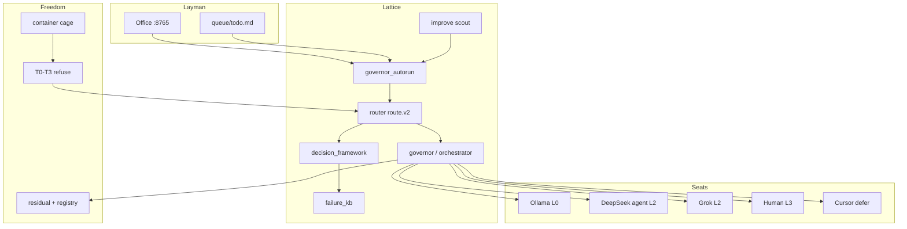

# Mag v2 — Freedom Lattice Plan

**Version:** 2.0.0-plan  
**Commitment:** `mag-v2-plan-002`  
**As-of:** 2026-08-05  
**Status:** Active — ponytail/caveman discipline + Lessig modalities

**Parents:** `lessig_1_6.md` · `PRODUCT_VISION_AUTORUN.md` · `MAG_OS_v2.md` · `OPERATOR_CARD.md`  
**Activation:** *Mag v2 freedom lattice* — load this + `MAG_Card.md` + `HANDOFF_MAG_AGENT_TODOS.md`

---

## 0. One line

**Self-improving agent lattice on your disk — layman door, silent router, forkable beads.**

Not: chat app. Not: mirror throne. Not: AI runs your life.

---

## 1. Lessig modalities (what binds)

| Modality | v2 rule |
|----------|---------|
| **Law** | G1 constitution/tiers/residual · G2 secrets · G3 irreversible=L3 · G4 operator_active pauses autorun |
| **Norm** | Pack-first · seat purity · FILE not chat · promote is human · no analysis leaf before trail |
| **Market** | Tokens price intelligence · L0 janitor first · L2 scarce · attention > model vanity |
| **Architecture** | `route.v2` one brain · container cage · FKB on fail · verkle tip = sessions only |

**Ponytail** ([dietrichgebert/ponytail](https://github.com/dietrichgebert/ponytail)): ladder for **code** — YAGNI, reuse, stdlib, minimum diff. Safety never cut.  
**Caveman**: density for **docs** — terse, exact, no filler. Security/irreversible breaks caveman.  
**Audit:** `python main.py ponytail-audit` before merge.

```text
LAW (gates) → NORM (habit) → MARKET (seats) → ARCHITECTURE (code that enforces)
```

---

## 2. What v2 is (three layers)

### 2.1 Product shape

```text
┌─────────────────────────────────────────────────────────┐
│  LAYMAN — Office :8765 · FIND/FILE/LOAD · one-line todo │
├─────────────────────────────────────────────────────────┤
│  LATTICE — router → seats → orchestrator → governor     │
│            improve · FKB · trail · context-pack           │
├─────────────────────────────────────────────────────────┤
│  FREEDOM — container cage · T0–T3 tiers · constitution   │
│            forkable beads · local-first residual        │
└─────────────────────────────────────────────────────────┘
```

| Layer | User sees | System does |
|-------|-----------|-------------|
| **Layman** | "Mag is working away" / "Paused while I code" / "Last night it…" | Autorun card, queue, heartbeat, honest empty states |
| **Lattice** | Nothing — operator never picks DeepSeek vs Grok vs Cursor | `route.v2` + decision framework + FKB + governor autorun |
| **Freedom** | "My footprint stays on my disk" | Docker boundary, tier refuse, residual DNA, no core-mirror privilege |

### 2.2 North star

A **self-improving agent lattice**: work descends to the cheapest safe seat, ascends only with a pack, failures become remedies, cycles leave a trail, and a second person can fork the practice without inheriting your residual.

### 2.3 Non-goals (v2)

| Out of scope | Why |
|--------------|-----|
| Life-ops (bills, disputes, subscriptions) | Later spore — needs agency-shape + L3 seal maturity |
| Train-as-identity / Unsloth craft staff | v1.5+ (`ORG_ROADMAP` C-track) |
| Public chain verify-leaf / PEPS cosplay | Story hash ≠ disk tip; honesty in `strike_origin.md` |
| Hermes as default seat | Parked — Mag venv is law (`AGENTS.md`) |
| X timeline as secret store | Public = witness + activation grammar; private disk = truth |
| Generic multi-agent framework | Coordination via pack + trail + Elias rope, not agent chat |

---

## 3. Foundation already shipped (v1 → v2 bridge)

Merge these before calling anything "v2 home install":

| PR | Branch | Delivers |
|----|--------|----------|
| **#8** | `cursor/unified-router-e2ce` | `mag/router.py` route.v2 · `main.py route/decide` · loop escalation |
| **#9** | `cursor/failure-kb-e2ce` | `mag/failure_kb.py` · remedy cards · behavioral wiring |
| **#10** | `cursor/mag-autorun-v1-e2ce` | `governor_autorun` · operator pause · FKB in scoring · `main.py autorun` |

### 2.1 What v1 autorun already does

```text
fill (improve + agent_state + handoff)
  → plan (depth · skills · cost · provider)
  → route (unified router)
  → execute (orchestrator drain / governor cycle)
  → record (governor_autorun_trail.jsonl)
  → loop (until empty or gate)
```

**Gates (unchanged in v2):**

- **G1** Constitution / data tiers / residual DNA — never violate
- **G2** Secrets — never read, never echo
- **G3** Irreversible — operator only (archive, delete, publish)
- **G4** Operator active — `MAG_OPERATOR_ACTIVE=1` pauses autorun while you code in Cursor

**Decision stack** (`docs/DECISION_LAYERS.md`):

```text
breadcrumbs (interference) → decision_framework → router
```

### 2.2 K8s mental model (for operators who think in infra)

| Mag concept | Analog |
|-------------|--------|
| `mag-sovereign` container | Control plane |
| Orchestrator spawn | Worker pod |
| Ollama sidecar | Node-local service |
| DeepSeek / Grok | External compute |
| Cursor + `watch/cursor_bridge.py` | Operator console |
| `memory/` mounts | Persistent volumes (your soil) |

---

## 4. Mag v2 phases

### Phase 0 — Single install path (exit: "clone → lab → autorun")

**Goal:** One honest home-PC path; no branch archaeology.

| # | Deliverable | Done when |
|---|-------------|-----------|
| 0.1 | Merge #8 → #9 → #10 → `main` | CI green; `routing_smoke.py` 9/9 |
| 0.2 | Container-first default | `docs/CONTAINER.md` + `install.ps1` documented as primary |
| 0.3 | `.env.example` complete | `MAG_DRAINER`, `MAG_OPERATOR_ACTIVE`, seat keys documented |
| 0.4 | `mag.cmd doctor` green | venv, Ollama reachability, REST :8765, tier refuse smoke |
| 0.5 | Autorun boot script | `scripts/start_autorun.sh` (or Windows task) in README |

**Acceptance test (home PC):**

```powershell
mag.cmd lab
python main.py autorun --once --dry   # plan only, no spend
python main.py autorun --once         # one cycle, trail row written
```

---

### Phase 1 — Layman Office (exit: non-engineer can answer "what is Mag doing?")

**Goal:** Dashboard speaks human; lattice stays invisible.

| # | Deliverable | Done when |
|---|-------------|-----------|
| 1.1 | **Autorun card** on dashboard | Three states: Working away · Paused (coding) · Last cycle summary |
| 1.2 | Wire `mag/autorun_status.py` → REST | `GET /api/v1/autorun` returns trail tail + queue + heartbeat |
| 1.3 | Governance toggle in UI | `POST /api/v1/governance` `operator_active` (backend exists) |
| 1.4 | One-line queue UX | `queue/todo.md` line + `[mag]` tag documented on Operator Card |
| 1.5 | Honest empty | "No unblocked work" — not fabricated tasks |

**Autorun card copy (draft):**

| State | Headline | Sub |
|-------|----------|-----|
| Active | Mag is working away | Last: `{goal}` · seat `{seat}` · `{ago}` |
| Paused | Paused while you code | Toggle when AFK to resume |
| Idle | Nothing queued | Add one line to todo or run improve |

**Files to touch:**

- `dashboard/rest.py` — `h_autorun` handler
- `dashboard/static/` — card component (extend Mag OS strip or Operate tab)
- `docs/HOW_TO_MAG_DASHBOARD.md` — layman section

---

### Phase 2 — Lattice hardening (exit: operator never chooses a seat)

**Goal:** Every entry point calls the same router; failures teach the system.

| # | Deliverable | Done when |
|---|-------------|-----------|
| 2.1 | Single route path | `coordinate`, `dispatch`, `governor_autorun`, REST `/api/v1/route` all use `mag.router.route` |
| 2.2 | FKB loop closure | ≥3 same signature → auto-draft remedy; governor penalizes repeat failures |
| 2.3 | Pack freshness gate | Stale pack blocks L2 escalate (org-review A4) |
| 2.4 | Seat matrix visible in dry-run | `main.py route "goal" --dry` always shows seat + reason |
| 2.5 | Hard tier refuse | Test: T0/T1 paths never hit remote providers |
| 2.6 | Loop collapse | `decision_framework.escalate_on_loop` + FKB nudge on agent_cli collapse |

**Seat descent rule (v2 law):**

```text
scut / brief / ask     → L0 Ollama
simple_code            → L0 or L2 agent (router cost)
heavy_code / plan      → L2 DeepSeek agent (pack required)
hard judgment + corpus → L2 Grok (pack + presented law)
irreversible / secrets → L3 Human (gate, never autorun)
cursor / composer      → defer to operator console
```

**Files (mostly exist — harden + test):**

- `mag/router.py` · `mag/decision_framework.py` · `mag/failure_kb.py`
- `mag/governor.py` — `score()` + FKB penalty
- `mag/autorun_common.py` — `fkb_block_for_goal`, `fkb_score_adjustment`
- `tests/test_router.py` · `tests/test_failure_kb.py` · `tests/test_autorun_v1.py`

---

### Phase 3 — Self-improvement loop (exit: daily habit without token bleed)

**Goal:** Improve scout + eval runs on schedule; human promotes candidates; autorun consumes them.

| # | Deliverable | Done when |
|---|-------------|-----------|
| 3.1 | Daily improve task | `scripts/register_improve_task.ps1` → 08:00 `mag.cmd improve --once` |
| 3.2 | Candidate → queue bridge | improve candidates surface in governor_autorun fill |
| 3.3 | Human promote gate | `mag.cmd promote --apply c-…` documented; no auto-promote |
| 3.4 | Habit docs current | `memory/improve/HABIT.md` · `SEATS.md` match live seats |
| 3.5 | Behavioral events → FKB | `operator_inbox.log_behavioral_event` feeds signatures |

---

### Phase 3.6 — Verkle intelligence (exit: chain history informs product)

**Goal:** Full Verkle analysis on schedule; gaps feed autorun; tickets reconciled.

| # | Deliverable | Done when |
|---|-------------|-----------|
| 3.6.1 | `main.py verkle-audit` | Deterministic audit + reconcile + `--dry` |
| 3.6.2 | `lattice-backfill` on schedule | Saturday `verkle-audit --full` |
| 3.6.3 | Local synth leaf | `memory/improve/daily/{date}-verkle.md` |
| 3.6.4 | Autorun fill from gaps | `governor_autorun` enqueues `[verkle]` warn/error |
| 3.6.5 | Dashboard graph | `graph_viewport` in lattice dashboard payload |
| 3.6.6 | Handoff doc | `HANDOFF_MAG_AGENT_TODOS.md` at repo root |

**Timing (home PC):** 6 leaves full pass ~15–25 min; deterministic <1s.

```bash
python main.py verkle-audit --dry
python main.py verkle-audit --full    # Saturday
```

---

### Phase 3.7 — Agentic contracts (exit: industry patterns stolen, not forked)

**Goal:** Map 2025–2026 SDK advances to Mag modules without second orchestrator.

| # | Deliverable | Done when |
|---|-------------|-----------|
| 3.7.1 | Landscape doc | `docs/ref/AGENTIC_LANDSCAPE_2026.md` |
| 3.7.2 | Steal list in handoff | A1–A12 table with status |
| 3.7.3 | Evaluator hook (P2) | pytest after heavy_code queue item |
| 3.7.4 | Resume contract test | trail + handoff survive kill |
| 3.7.5 | MCP bridge (optional) | Mag REST as MCP for external seats |

**Steal, don't import:** OpenAI sessions → residual; Anthropic evaluator → pytest; ADK typed state → route.v2 schema.

---

### Phase 3.8 — Ponytail discipline (exit: lean code, dense docs)

**Goal:** Run [ponytail](https://github.com/dietrichgebert/ponytail) ladder on Mag; caveman density on plan docs.

| # | Deliverable | Done when |
|---|-------------|-----------|
| 3.8.1 | `ponytail-audit` CLI | `python main.py ponytail-audit` |
| 3.8.2 | Baseline doc | `docs/ref/PONYTAIL_CAVEMAN_AUDIT.md` |
| 3.8.3 | Pre-merge gate | ponytail-audit medium/high = 0 |
| 3.8.4 | Single-law constants | `DEPTH_JOB_MAP` from `mag.router` only |

**Ladder (code):** YAGNI → reuse → stdlib → native → installed dep → one line → minimum.  
**Never cut:** tiers, gates, FKB, residual, validation at trust boundary.

**Improve cycle (existing):**

```text
scout → eval → memory/improve/candidates/
  → human promote → configs / skills / remedies
  → autorun fill picks promoted work
```

---

### Phase 3.9 — Mag Workstation / virtual desk (exit: research → ops → optional cage GUI)

**Goal:** Mag plugs away on a **second desk** while operator codes elsewhere — isolation, observability, optional headless GUI in container only.

| # | Deliverable | Done when |
|---|-------------|-----------|
| 3.9.0 | Research proposal | `docs/ref/RESEARCH_MAG_VIRTUAL_DESK.md` — feed external agent |
| 3.9.1 | Research report | Filled §8 template in `memory/research_packs/mag_virtual_desk/REPORT.md` |
| 3.9.2 | Operator ritual doc | Windows two-desk + AFK env (`MAG_DRAINER`, virtual desktop) |
| 3.9.3 | `MAG_WORKSTATION` profile | Optional: Playwright/xvfb in compose — localhost only |
| 3.9.4 | Lab card | Autorun overnight summary readable without chat scroll |

**Depends on:** Phase 1 autorun (#10), container (`CONTAINER.md`). **Not** a second orchestrator.

---

### Phase 4 — Spore spine (optional module — exit: public witness without secret storage)

**Goal:** X timeline as activation grammar + witness museum; disk remains truth.

| # | Deliverable | Done when |
|---|-------------|-----------|
| 4.1 | Spine index file | `memory/improve/pins/spine_posts.json` — post IDs + roles |
| 4.2 | Seed from strike_origin | Operator five links + napkin anchors indexed |
| 4.3 | Optional `mag/spore_channel.py` | Read-only: map post ID → pack snippet; no write to X |
| 4.4 | Scout hook | improve scout can pin "spore alignment" eval (optional) |
| 4.5 | Honesty guard | UI never claims story root hash = disk tip |

**Spine posts (seed — from `strike_origin.md` + operator links):**

| Role | Example |
|------|---------|
| Napkin relic | `2028342347361141030` |
| PoC shape | `206292352…` |
| Marble OS | `207120477…` |
| Operator-linked | IDs in `memory/working_product_dna.json` |

**Rule:** Riddles/ciphers on X = activation keys, not ciphertext storage.

---

### Phase 5 — Fork / forest (exit: second person runs without king)

**Goal:** Publish code + practice; never publish residual by default.

| # | Deliverable | Done when |
|---|-------------|-----------|
| 5.1 | Fork README | Clone → container → empty `memory/` → first brief |
| 5.2 | ZEITGEIST link | Beads (Mag) + forest (`mycelial-republic`) documented |
| 5.3 | No core-mirror throne | No privileged "canonical" residual in repo |
| 5.4 | Template pack | `docs/templates/` + `FEATURE_COMPOSE.md` for first leaf |
| 5.5 | Strike skill optional | `strike-chord` as entropy seat, not daily costume |

Aligns with `ORG_ROADMAP` 3.x spore forest — parallel track, not blocking Phases 0–3.

---

## 4. Architecture diagram (v2 steady state)



---

## 5. How this relates to peer tools

Mag v2 does not replace these — it **routes around** them:

| Tool | Mag relationship |
|------|------------------|
| **Cursor Composer** | Operator console; `watch/cursor_bridge.py` pack + defer seat |
| **Claude Code** | Future bridge (same pattern as cursor_bridge) — defer / pack |
| **OpenClaw** | Inspiration for proxy shape; Mag adds residual + tiers + autorun |
| **Google ADK** | Seat rental pattern; Mag owns dispatch + trail |
| **Hermes** | Parked; not default `python` on PATH |

**Collision rule:** One goal → one route decision → one seat. No parallel "shadow dispatch."

---

## 6. Operator modes (daily)

| Mode | `.env` | Behavior |
|------|--------|----------|
| **Coding** | `MAG_OPERATOR_ACTIVE=1` | Autorun paused; Cursor owns edits; Mag packs + briefs |
| **AFK** | `MAG_OPERATOR_ACTIVE=0`, `MAG_DRAINER=1` | Autorun fills + drains queue |
| **Manual** | `MAG_DRAINER=0` | You drive `mag.cmd run` / `ask` / `brief` |
| **Force drain** | `MAG_DRAINER_FORCE=1` | Override pause (debug only) |

**Home activation checklist:**

```powershell
git pull origin main
mag.cmd doctor
mag.cmd lab
# AFK:
$env:MAG_OPERATOR_ACTIVE = "0"
python main.py autorun
# or: scripts/start_autorun.sh (Linux) / scheduled task (Windows)
```

---

## 7. Metrics & definition of done

### 7.1 v2 code exit (Phases 0–2)

| Metric | Target |
|--------|--------|
| `routing_smoke.py` | 9/9 PASS |
| `pytest` autorun + router + FKB | green |
| Tier refuse test | T0/T1 never remote |
| Autorun dry-run | plan row in trail |
| Dashboard autorun API | 200 + honest states |
| Container boot | lab :8765 < 60s |

### 7.2 v2 product exit (Phases 0–3)

| Metric | Target |
|--------|--------|
| Layman can answer status | without reading Python |
| One install doc | container-first |
| Daily improve | scheduled or documented |
| FKB remedies | ≥1 human + ≥1 auto-drafted in use |
| Trail audit | governor_autorun_trail explains last 24h |

### 7.3 v2 forest exit (Phase 5)

| Metric | Target |
|--------|--------|
| Second clone | completes doctor + first brief without operator chat |
| No residual in git | `.gitignore` + honesty in README |
| Republic link | ZEITGEIST / forest doc reachable |

---

## 8. Immediate work queue (ordered)

**This week (engineering):**

1. Merge PR #8, #9, #10 → `main`
2. Phase 1.1–1.2: `GET /api/v1/autorun` + dashboard card
3. Phase 2.5: tier refuse integration test
4. Update `HOW_TO_MAG_DASHBOARD.md` with autorun section

**Next (product):**

5. Phase 3.1: register improve daily task on home PC
6. Phase 4.1: `spine_posts.json` seed file
7. Phase 5.1: fork README section

**Deferred:**

- Claude Code bridge
- Memory palace graph (ORG_ROADMAP 0.95)
- verify-leaf chain (2.0)

---

## 9. Document map

| Doc | Role in v2 |
|-----|------------|
| **`MAG_PROJECT_PROPOSAL.md`** | **Full project proposal — where we are, where we're going (alpha → v2 → v3)** |
| `MAG_v2_PLAN.md` (this) | Roadmap + phases + acceptance |
| `HANDOFF_MAG_AGENT_TODOS.md` | Master agent/operator queue |
| `AGENTIC_LANDSCAPE_2026.md` | Industry steals mapped to Mag |
| `PONYTAIL_CAVEMAN_AUDIT.md` | Ponytail ladder + caveman doc discipline |
| `MAG_OS_v2.md` | Governance surface + Phoenix |
| `PRODUCT_VISION_AUTORUN.md` | Product one-liner + gates |
| `OPERATOR_CARD.md` | Layman FIND/FILE/LOAD |
| `DNA.md` | Residual constitution |
| `CONTAINER.md` | Freedom cage install |
| `MAG_v3_RESEARCH_PLAN.md` | **v3 only** — spider, resonance, L-exp, workstation research (not v2 ship) |
| `DECISION_LAYERS.md` | Router stack |
| `strike_origin.md` | Spore spine history |
| `memory/improve/HABIT.md` | Token bleed seats |
| `AGENTS.md` | Harness rules for agents |

---

## 10. One paragraph for Nacho

Mag v2 is the moment the harness stops being "a repo with seats" and becomes **a product**: you write one line in todo, flip AFK mode, and the lattice picks Ollama vs DeepSeek vs defer-to-Cursor without you thinking about it — while the Office tells you honestly what happened overnight. The freedom part is structural: container cage, tier law, residual on your disk, forkable practice. The spore spine (X posts, strike activation) is optional witness grammar, not the engine. Merge the three open PRs, ship the autorun card, harden the router path, and you have v2 code; daily improve + fork docs make it v2 product.

---

*End plan — commitment `mag-v2-plan-001`*
